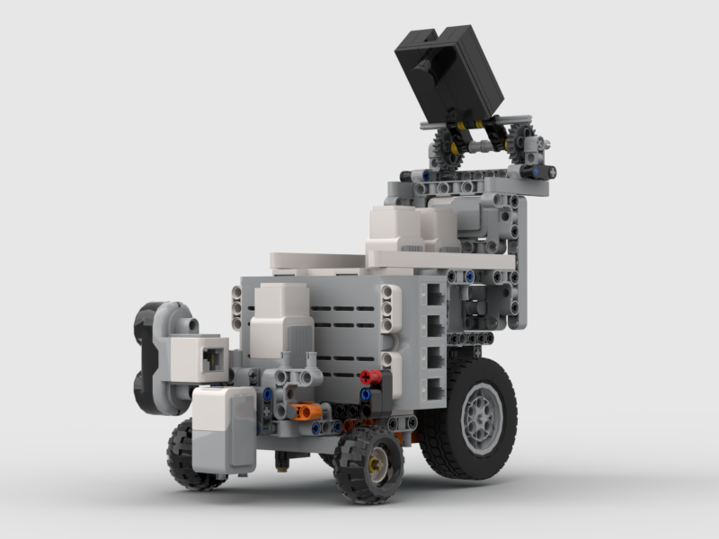
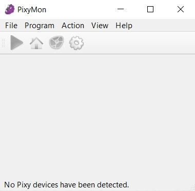
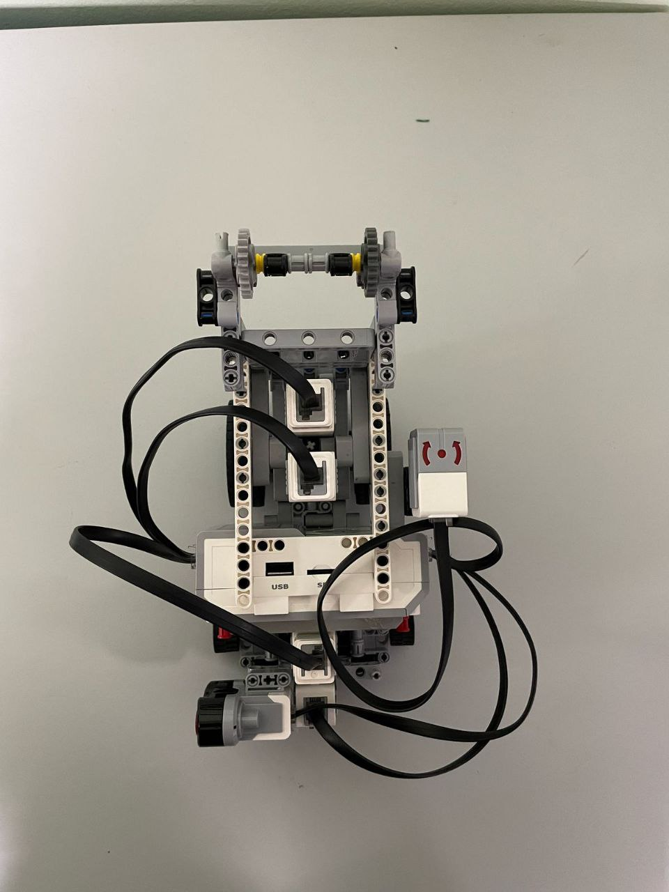
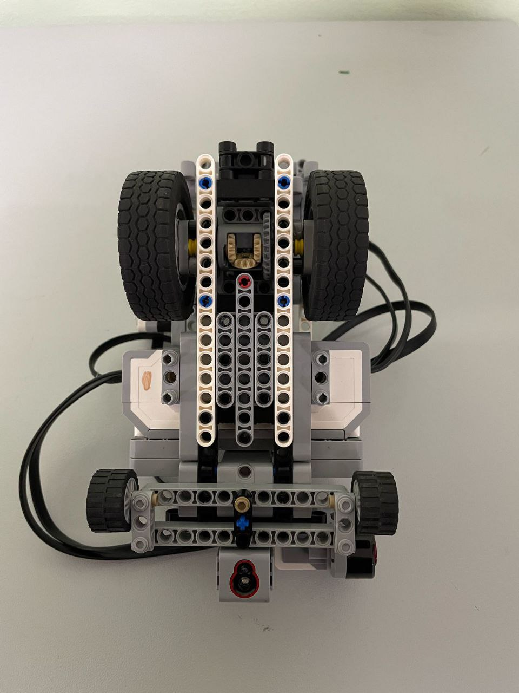
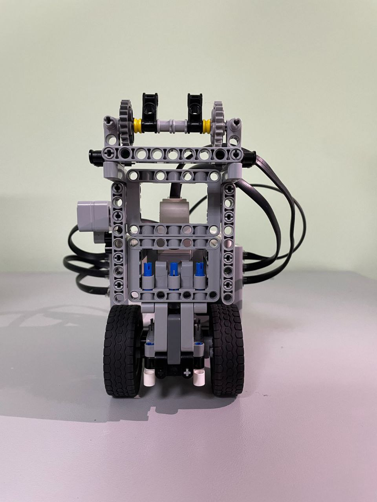
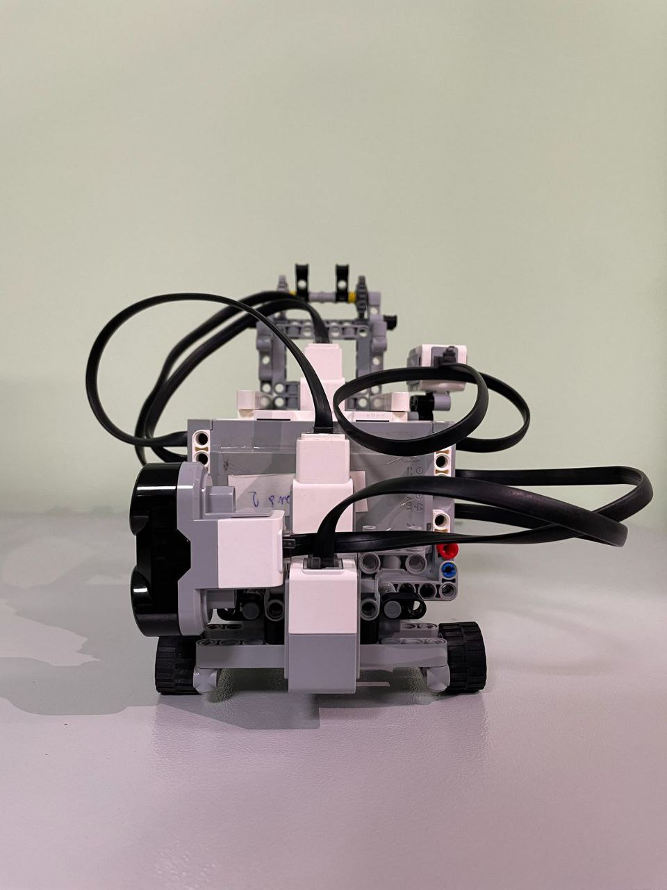
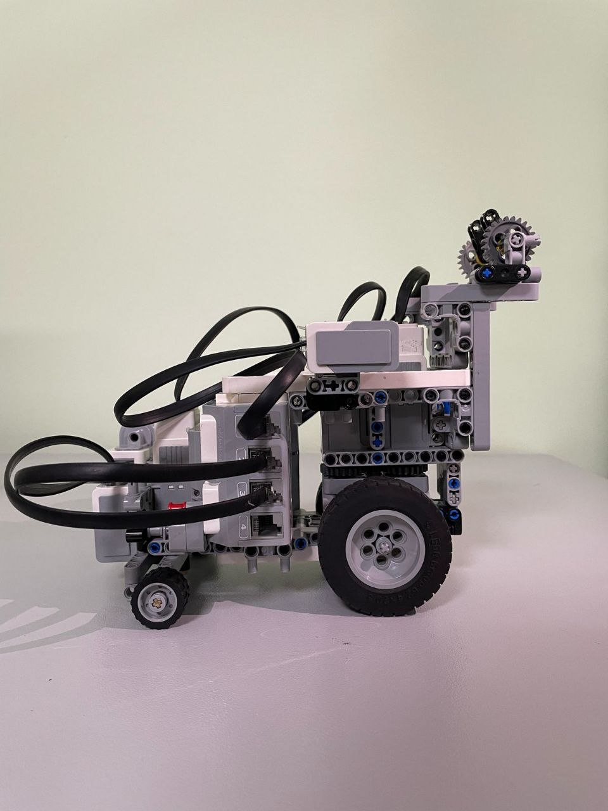
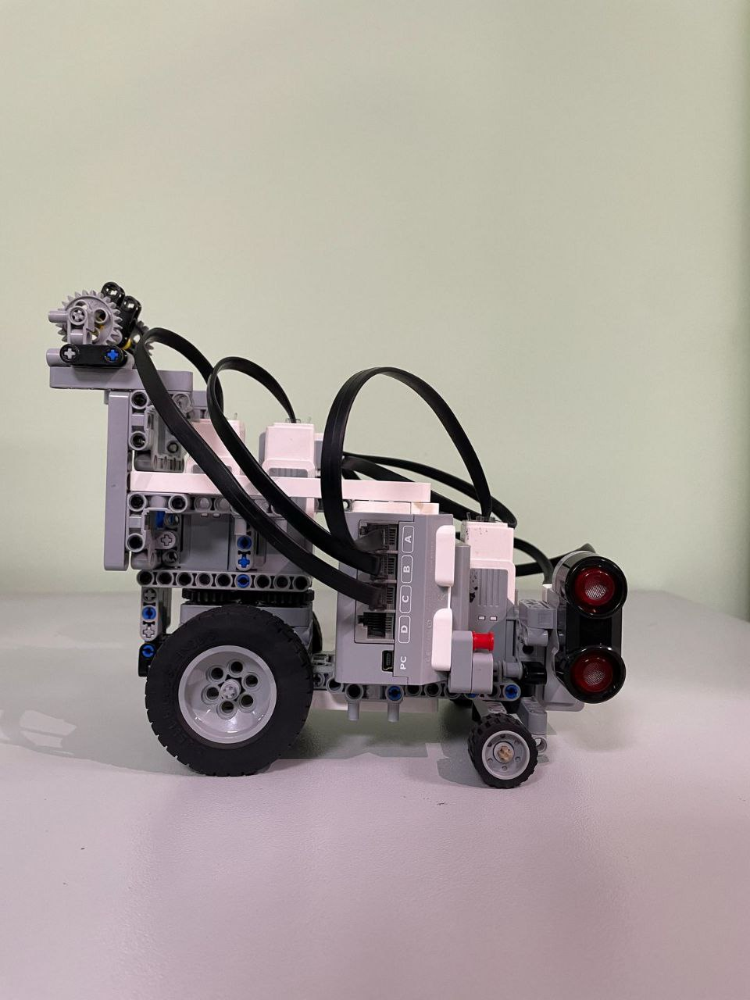

***

## Contents

* [**Mobility Management**](#mobility-management)
  * [Motor Selection and Implementation](#motor-selection-and-implementation)
  * [Chassis Design and Implementation](#chassis-design-and-implementation)
* [**Power and Sense Management**](#power-and-sense-management)
  * [Sensor Management](#sensor-management)
* [**Obstacle Management**](#obstacle-management)
  * [Sensor-Based Obstacle Detection](#Sensor-Based-Obstacle-Detection)
  * [Trajectory Calibration](#trajectory-calibration)
* [**Photos**](#photos)
  * [Vehicle Photos](#vehicle-photos)
* [**Robot Parts Disscussion**](#robot-parts-disscussion)

***
## Our vehicle:
We built the robot using parts from the EV3 MINDSTORMS Education kit, a Pixy v2 camera, and additional LEGO Technic pieces.

Full assembly instructions can be found here: [Instruction](models/Robot_Instruction.pdf)

The 3D model (made in Studio 2.0) is available here: [3D Model](models/FE-Robot.io)
 
***

## Mobility Management

### Motor Selection and Implementation

Motor choice is a key part of our autonomous driving system. The EV3 kit includes Large and Medium motors. We evaluated both based on speed, torque, and encoder precision.

COMPARE THE TWO MOTORS:

The Large Motor operates at a speed of 160–170 RPM, delivering a running torque of 20 N·cm and a stall torque of 40 N·cm. It is slower but provides greater power.

The Medium Motor operates at a higher speed of 240–250 RPM, with a running torque of 8 N·cm and a stall torque of 12 N·cm. It is faster but has less torque.

Large motors are powerful, but Medium motors are smaller and lighter, which saves space and improves responsiveness.
Due to our robot's size limit (300x200x300mm) and the focus on speed, we chose three Medium motors: one for steering and two for driving.

### Chassis Design and Implementation

The front steering uses small wheels, while the rear driving wheels are larger and placed close together.

This setup increases linear speed and compensates for the lack of a differential system. The narrow rear wheel spacing helps reduce turning friction and improves maneuverability.

***

## Power and Sense Management

### Sensor Management

The robot uses several sensors for accurate and autonomous navigation:

Color Sensor — detects colored lines (orange or blue) on the field to help the robot turn and follow the correct path.

Ultrasonic Sensor — mounted in front to measure the distance to barriers and helps keep track of the robot's position during turns.

Gyro Sensor — keeps the robot aligned using a PID controller that constantly corrects any deviation from the desired direction.

Pixy v2 Camera — used during obstacle rounds to detect red and green obstacles.

### Power Management

The robot is powered by a 10V rechargeable Li-ion battery. The EV3 brick includes multiple power regulation systems.

It also has 3 polyswitches for protection: one for each motor driver and one for the main circuit. Each switch holds at 1.1A and trips at around 2.2A to prevent damage.

***

## Obstacle Management

Obstacle handling is essential for autonomous navigation, especially during the obstacle challenge in WRO.

### Sensor-Based Obstacle Detection

The Pixy v2 camera is used to detect red and green objects.
With PixyMon, we calibrate the camera to recognize color signatures accurately, so the robot can reliably identify and differentiate obstacles.

### Trajectory Calibration
We test the robot by placing obstacles in known locations on the field and letting it drive around them.
We record the positions of the obstacles and use tools like Excel or Google Sheets to plot the coordinates.

From the graph, we build an exponential function that describes the ideal path for obstacle avoidance.

### Robot Parts Disscussion
Robot Parts Disscussion: https://youtu.be/IYjKvkjYMmY?si=9bRZYH7btq0FoGnj
 
## Photos

### Vehicle Photos

***

